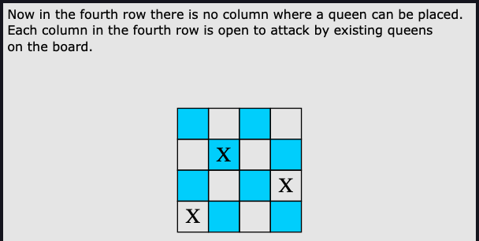

# Backtracking

Backtracking is a technique that explores paths to find a solution, building a
solution step by step by increasing values with time and removing choices that
don't contribute to the solution based on some constraints. Unlike recursion
which calls a function until it reaches a base case backtracking tries to
explore all possible paths to a solution. 

Backtracking first explores one possible solution, if the required criteria
have been met with that option, a path that stems from that option is chosen
and we continue exploring that solution. If we reach our solution we return it
otherwise if our condition is violated at some point in the path we backtrack
and explore another path. 

Backtracking is better than brute-force as we don't have to generate all
possible solutions. It provides us with the option to check our required
condition at each possible recursive call. If the condition is met, we continue
that path, if not we take a step back and explore another path. 

## Examples

### Find a path of 1s from top-left to bottom-right in an nxn binary maze


## How to Know if a Problem is this type?
* While constructing any possible solution, all paths must be explored. Meaning
  if exploring a certain path results in a dead end, we need to move back one
  level and explore all other paths in the solution space. 
* The problem requires us to consider all feasible solutions in order to select
  the best one. While solving such a problem, not a single feasible solution
  may be ignored. 
* The problem requires us to compile a list of all feasible solutions. 
* It does not if while constructing a solution, failing to meet the
  acceptability criteria eliminates all other possibilities within that solution
  so those remaining possibilities need to be checked. 

  Example: Given a set of integers and a target sum, determine if any subset of
  the given set of integers can sum up to the target sum. The nature of the
  problem is such that, once we find a subset that sums up to the target, there
  is no need to continue exploring other subsets. Similarly, if we reach a
  point where adding any additional elements to the current subset would result
  in the sum exceeding the target, there is no need to explore any more
  possibilities for that subset.

## Real World Examples

**Constraint satisfaction problems**: Backtracking is used to solve puzzles
such as Sudoku. 

**Recursive descent parsers**: The compiler takes a path through the grammar
and reaches a point where the incoming tokens no longer match that part of the
grammar. Therefore, the compiler backtracks to a point where there is another
path through the grammar and follows that. This can occur several times until
the compiler finds a grammar path that fits the incoming tokens, in which case
it accepts the construct. If it find no matching path, a syntax error is shown.

## Problems

### N Queens
Given a chessboard of size `n x n` determine how many ways n queens can be
placed on the board such that no two queens attack each other. 

#### Constraints
* A queen can move horizontally, vertically, and diagonally on a chessboard.
  One queen can be attacked by another queen if they both share the same row,
  column, or diagonal
* `1 <= n <= 9`


#### Solution

1. Start by placing a queen in the first column of the first row of the chess
   board. 
2. Since you can't place another queen in a row that already has one, search
   for a safe position for the next queen in the next row. 
3. Iterate over the rows to find a safe placement for the queens. Store the
   column number where a queen is placed in a list. 
4. If a safe position is not found, backtrack to the previous valid placement.
   Search for another solution.
5. If a complete solution is found add it to the results array and backtrack to
   find other valid solutions in the same way.

 





```java
import java.util.*;
public class Main{
     
    /** 
     * This function is the main function called to solve the N Queen problem.
    */
    public static int solveNQueens(int n) {
        List<List<Integer>> results = new ArrayList<>();
        /** 
         * This creates a list of integers size n filled with -1
         * This array represents a solution as the queen placement storing 
         * the row with its index and the column as the value for each queen.
         * IE: for a solution with n = 4 it would be stored as: 
         * solution: [2,4,1,3] (See last image above)
        */ 
        List<Integer> solution = new ArrayList<Integer> (Collections.nCopies(n, -1));

        solveNQueensRec(n, solution, 0, results);
        return results.size();
    }
    /** 
     * Recursive function which solves the N Queen Problem. 
    */
    public static void solveNQueensRec(int n, List<Integer> solution, int row, List<List<Integer>> results) {
        /** 
         * Base Case
         * If the row passed in is equal to the number of queens we are solving
         * for then all queens have been placed since we started placing at 0.
        */
        if (row == n) {
            results.add(solution);
            return;
        }
        // Iterate through all the columns in the row.
        for (int column = 0; column < n; column++) {
            /**
            * Determine if placing at the i'th column is a valid move. If there 
            * is no valid move we do not continue to check further columns.
            * This check is what helps us do our "backtracking."
            */ 
            boolean valid = isValidMove(row, column, solution);
            if (valid) {
                //If valid, add the position of the queen to the solution
                solution.set(row, column);
                solveNQueensRec(n, solution, row + 1, results);
            } 
        }
    }
    /** 
     * This method determines if a queen can be placed at proposedRow, proposedCol
     * with current solution. Move is valid only if no queen in current
     * solution may attack the square at proposedRow and proposedCol.
    */
    public static boolean isValidMove(int proposedRow, int proposedCol, List<Integer> solution) {
        int possibleExistingQueenPlacementRow = 0;
        int possibleExistingQueenPlacementCol = 0;
        int diagonalOffset = 0;

        for (int i = 0; i < proposedRow; i++) {
            possibleExistingQueenPlacementRow = i;
            //This is the possible queen placement.
            possibleExistingQueenPlacementCol = solution.get(i);
            /**
             * The diagnal offset is created by subtracting the row where a 
             * queen could be from the proposed row. This would put them in the
             * same column.  
             */
            diagonalOffset = proposedRow - possibleExistingQueenPlacementRow;

            /**
             * If the possible queen placement column is the same as the 
             * porposed column that means there is a queen at the same column
             * as the proposed column and the move is not valid. 
             *
             * The diagonal offset is used to check to the right and left of the 
             * proposed column to see if there is a queen already placed.
             */
            if (possibleExistingQueenPlacementCol == proposedCol || 
                possibleExistingQueenPlacementCol == proposedCol - diagonalOffset || 
                possibleExistingQueenPlacementCol == proposedCol + diagonalOffset) {

                return false;
            }
        }

        return true;
    }
}
```

### Word Search

Given an `m x n` 2D grid of characters and a `word` given as a String. We need
to determine if the word can be constructed from letters of sequentially
adjacent cells. The cells are considered sequentially adjacent when they are
neighbors to each other horizontally or vertically. The function should return
`TRUE` if the word can be constructed and `FALSE` if not. 

#### Constraints
* `m = board.length`
* `n = board[i].length` where `0 <= i < m`
* `1 <= m,n <= 6`
* `1 <= word.length <= 15`
* `board` and `word` consist of only lowercase or uppercase English letters.
* The search is not case-sensitive. 

### Solution
1. Search through the grid for the first letter of the word. 
2. If you find the first letter start checking all 4 adjacent letters for the
   next letter. If you find it move to that letter and start checking the
   adjacent letters (except for the one you just moved from) for the next
   letter.
3. If you do not find the next letter, backtrack to see if you find another
   character where you can continue searching for the next character. 
4. If you find all the characters in the word, return `TRUE`.
5. If you've checked all the potential paths for each of the starting chars in
   the word and do not find it, return `FALSE`.

```java
import java.util.*;
class WordSearch {
    public static boolean wordSearch(char[][] grid, String word) {
        // Write your code here
        return  false;
    }
    List<Character> state; // The current state 
    List<Character> choices;  // Possible next moves based on current state
    List<List<Character>> res; // All possible valid states
    
    // Initialize state and choices
    Backtracking(List<Character> st, List<Character> ch){
        state = st;
        choices = ch;
    }
    
    // To check the current state is a valid solution or not
    boolean isSolution(List<Character> state){
        // Replace this placeholder return statement 
        // with your code to check this solution
        return false;
    }
    
    // To check the current choice is a valid choice or not
    boolean isValid(char choice){
        // Replace this placeholder return statement 
        // with your code to check the validity of this choice
        return false;
    }
    
    // We can use this function to evaluate all the states and store the valid states
    void dfs(List<Character> state){
        if (isSolution(state)){
            res.add(state); // e.g. add a copy of the state to final result list
            return ;
        }
       for (char choice : choices){
            if (isValid(choice)){
                state.add(choice); // make move
                dfs(state);
                int indexOfLastElement = state.size() - 1;
                state.remove(indexOfLastElement); // backtrack
                
            }
       }
    }
}
```
