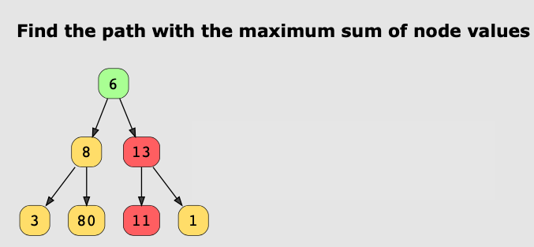

# Greedy Techniques
The Greedy technique builds a solution piece by piece choosing the next most
obvious and immediate benefit. It always makes the choice that seems the best
at the time, making a *locally-optimal choice* in the hope that it will make a
globally optimal solution. Therefore the greedy technique is used to solve
optimization problems. 

Greedy algorithms work by recursively constructing a solution from the smallest
possible constituent parts. As a reminder recursion is an approach where the
problem is solved by splitting the problem down into smaller instances of the
problem, solving those problems and then combining the results to get an
overall solution. Usually this approach does not produce the globally best
solution since it is optimizing decisions locally.

See example below where the greedy solution (shown in red choices) produces a
not globally optimal solution.



## How to know if a problem matches this pattern?
* If selecting a series of local optima allows us to construct or identify the
  globally optimal solution. 
* Our analysis shows that making local greedy choices to not lead to a
  sub-optimal solution. 
* The problem has a local optima.
* The problem is an optimization problem. 

## Real-world Examples
* **CPU Scheduling** - Many algorithms using the greedy approach help in CPU
  scheduling. 
* **LAN Networks** - In a large LAN with many switches, finding a minimum
  spanning tree is important to ensure that only a minimum number of packets
  will be transmitted across the network. 
* **Social Networking Websites**: - Recommending a list of people a user may
  know through the Dijkstra algorithm which finds the shortest path between
  users measured through connections among them.

## Examples

### Jump Game
In a single-player jump game, the player startsat the end of a series of
squares with the goal of reaching the last square. At each turn the player can
take up to `s` steps towards the last square, where `s`is the value of the
current square. The player cannot move away from the square at any point. 

You have been tasked with writing a function to validate whether the player can
win a given game or not. You are provided with a `nums` integer array,
representing the series of squares. The value at every index represents the
maximum number of jumps you can take from that point. The player starts at the 
first index and follows the rules of the game trying to reach the last index. 

If the player can reach the end return `TRUE` otherwise return `FALSE`. 

#### Example Run
Input: `[2,3,1,1,4]` 
Output: `TRUE`

Input: `[3,0,0,0,0]` 
Output: `FALSE`

#### Solution
1. Set the last element in the array as your initial target. 
2. Traverse the array from the end to the first element in the array. 
3. If the current index is reachable from any preceding index, based on the
   value at that index, make that index the new target. 
4. If you reach the first index of the array without finding any index from
   which the current target is reachable, return false. 
5. Else, if you are able to move each current target backward, all the way to
   the first index of the array, you've found a path from the start to the end
   of the array, return true.

```java
public class JumpGame{
   public static boolean jumpGame(int[] nums) {
      int currentIndex = nums.length - 1; 
      //Iterate through the possible jumps from the current location.
      for (int i = nums.length - 2; i >= 0; i--) {
        // Here we are checking if we can get to the current Index from the 
        // previous index using the value at the previous (at least the previous
        // for the first iteration).
        //
        // The only concern I have with this approach is how do you know for 
        // certain that you did not make an incorrect jump as you are moving
        // backward? 
        // This question seems to have an answer: 
        // https://cs.stackexchange.com/questions/146619/greedy-stays-ahead-proof-of-jump-game
        if (currentIndex <= (i + nums[i])) {
          //If we can we update the currentIndex to the index at i.
          currentIndex = i;
        }
      }
      //If when the loop finishes executing we are at the start we can make it.
      if (currentIndex == 0) {
        return true;
      }
      // If when the loop finishes we are not at the start we can't make it. 
      return false;
   }
}
```

### Boats to Save People
A ship with a lot of passengers is sinking and needs to be evacuated using the
minumum number of life-saving boats. Each boat can carry, at most, two persons
however the weight of the people cannot exceep the carrying capacity of the
boat.

Given an array, `people`, where `people[i]`, is the weight of the i'th person
and an infinite number of boats where each boat can carry at most the `limit`
weight. 

Return the number of minimum boats to carry all the people in the array.

**Constraints**
* `1 <= people.length <= 3 * 10^3`
* `1 <= people[i] <= limit <= 3 * 10^3`

#### Solution
1. Sort the people array so that the lightest person is at the start of the
   array. 
2. Intiialize two pointers - left at the start and right at the end. 
3. Iterate over the `people` array and check if the combined weight of the
   lightest and heaviest person is under the limit. If it is increment the `left`
   pointer and decrement the `right` pointer.
4. Otherwise rescure the heaviest person alone and decrement the `right`
   pointer. 
5. Increment the number of boats. 
6. Once finished return the number of boats.


