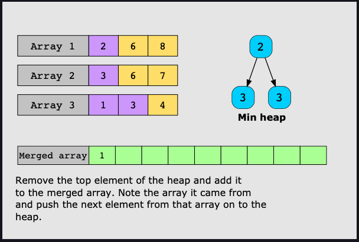
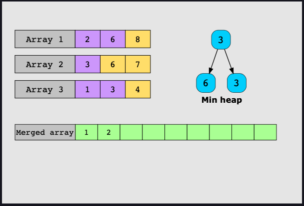

# K-way Merge

This pattern helps to solve problems involving a list of sorted arrays. Here is
what it looks like: 

1. Insert the first element of each array in a min-heap. 
2. Remove the smallest element from the heap and add it to the merged array.
3. Keep track of which array each element comes from.
4. Then insert the mext element of the same array into the heap. 
5. Repeat steps 2 to 4 to fill the merged array in sorted order. 

Here is how it works: 

In this first picture you can see what the min heap and the merged array looks
like  after the first time you get to step 4. 



In this picture you can see what it looks like the second time it gets to step
4.



## How to Know if a problem matches this pattern

Yes, if both these conditions are fulfilled:
* The problem involves a set of sorted arrays, or a matrix of sorted rows or 
sorted columns that need to be merged, either for the final solution, or as an 
intermediate step.

* The problem asks us to find the `kth` smallest or largest element in a set 
of sorted arrays or linked lists.

No, if either of these conditions are fulfilled:

* The input data structures are neither arrays, nor linked lists.
* The data is not sorted, or it’s sorted but not according to the criteria 
relevant to solving the problem.

## Real-world problems
Many problems in the real world use the k-way merge pattern. Let’s look at some examples.

1. *Merge tweets in twitter feed:* Sometimes we need to implement a module that 
adds a user’s Tweets into an already populated Twitter feed in chronological order.

1. *Used in external sorting procedures:* When an algorithm is processing huge 
amounts of data, it needs to repeatedly fetch it from external storage because 
RAM capacity is fixed. To overcome the speed limitation of external storage, 
k-way merges are used in external sorting. Let’s consider a case where we need 
to perform six merges. A binary merge requires three merge passes while a 
6-way merge only requires one pass. K-way merge reduces the number of accesses 
to external storage, which in turn greatly improves performance when dealing 
with large amounts of data.

## Examples

### Merge Sorted Array
Given two sorted integer arrays, `nums1` and `nums2`, and the number of data 
elements in each array, `m` and `n`, implement a function that merges the 
second array into the first one. You have to modify `nums1` in place.

#### Constraints
* `nums1.length = m + n`
* `nums2.length = n`
* 0 <= `m`, `n` <= 200
* 1 <= `m + n` <= 200

#### Solution

```java
public static int[] mergeSorted(int[] nums1, int m, int[] nums2, int n) {
  int p1 = m-1;
  int p2 = n-1;
  int p = nums1.length - 1;

  while(p2 >= 0) {
  // If the value at p1 is greater than the value at p2, set the value at
  // p equal to p1 and decrement p1 and p by 1
  if(nums1[p1] > nums2[p2]) {
     if(p2 < 0) {
          break;
     }
     nums1[p] = nums1[p1];
     if(p1 < p){
        nums1[p1] = Integer.MIN_VALUE;
     }
     p--;
     p1--;
  // else if the value at p2 is greater than the value at p1, set the value at 
  // p equal to p2 and decrement p2 and p by 1
  } else if (nums2[p2] >= nums1[p1]) {
     nums1[p] = nums2[p2];
     p--;
     p2--;
  }
  }
  return nums1;
}
```

```java
public static int[] mergeSorted(int[] nums1, int m, int[] nums2, int n) {
  int p1 = m-1;
  int p2 = n-1;
  int p = nums.length - 1;
  // Iterate through the length of nums1 as it is the larger array where
  // all our numbers will end up.
  while(p >= 0) {
    // If p2 is <0 that means we've compared all the numbers in both
    // arrays and we can stop.
    if (p2 < 0) {
     break;
   }
   // If p1 is 0 or less we have compared all the numbers in p1 so we 
   // should stop. Otherwise we should compare to see which is bigger. 
   // nums1[p1] or nums2[p2]
   if(p1 >=0 && nums1[p1] > nums2[p2]) {
    nums1[p] = nums1[p1];
    p--;
    p1--;
   // We use an else statement because if we either have nums2[p2] 
   // greater than nums1[p1] or we have finished all the p1 numbers
   // and we just need to fill in the rest of p2 
  } else {
   nums1[p] = nums2[p2];
   p--;
   p2--;
 }
}
return nums1;
}
```
