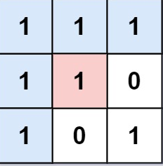
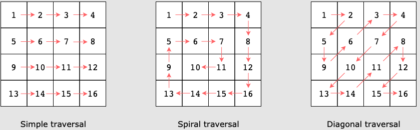

# Matrices
A matrix is a group of numbers arranged in rows and columns in a rectangular
pattern. In computer science matrixes are represented by 2D arrays with
dimensions `m x n` where m = rows, and n k columns. Each element in the matrix
can be accessed by using the array indexes. The first index represents the row,
the second index represents the column. For example `matrix[i][j]` is the
element from the `ith` row and `jth` column.

**Example:**
This Matrix:
`[[1,1,1],[1,1,0],[1,0,1]]`
Looks like: 



Most problems requiring matrixes can be solved using the following operations: 

* Matrix transformations: A few transformations are scaling, translation,
  rotation, and reflection. 
* Matrix traversals: A few matrix traversals are simple, spiral, and diagonal
  traversals. 



## Use Cases
* Process digital images. Each element of the matrix represents a pixel of the
  image.
* Represent a graph as an adjacency matrix where each row represents a vertex
  and each column represents an edge. 
* Store results of subproblems calculated whiel solving a problem using dynamic
  programming. 
* Solve different mathematical equations, for example, various problems related
  to linear algebra.
* Implement a grid game, such as chess, Candy Crush, Sudoku, Snake, or
  Tic-tac-toe.

## Examples

### Flood Fill

An image represented by a `m x n` matrix where `image[i][j]` represents the
pixel value of the image. 

Given three integers, `sr`, `sc`, and `color`. Preform a **flood fill** on the
image starting from the pixel `image[sr][sc]`. 

To preform a flood fill, consider the starting pixel, plus any pixels connected
4-directionally to the starting pixel of the same pixel, plus any connected
4-directionally to that pixel (of the same color), and so on. Replace the color
at those pixels with `color`.

```java
class Solution {
    /**
     * Solution 1: Basic Recursion, create a floodFillRec method which takes 
     * the same inputs as the function plus parameter tracking current color. 
     * Pass in the first value and re call the method for every cell in each 
     * of the 4 directions.
     * Base case: Color at cell doesn't match current color, row or column out
     * of bounds or we are at a cell that is already the color we want to move
     * to.
     */
    public int[][] floodFill(int[][] image, int sr, int sc, int color) {
        int colorToBeUpdated = image[sr][sc];
        image[sr][sc] = color;
        floodFillRec(image, sr-1, sc, color, colorToBeUpdated);
        floodFillRec(image, sr+1, sc, color, colorToBeUpdated);
        floodFillRec(image, sr, sc+1, color, colorToBeUpdated);
        floodFillRec(image, sr, sc-1, color, colorToBeUpdated);

        return image;

    }

    public void floodFillRec(int[][] image, int sr, int sc, int newColor, int colorToBeUpdated) {
        if (sr < 0 || sr >= image.length) {
            return;
        }
        if (sc < 0 || sc >= image[sr].length) {
            return;
        }
        // Don't need to update pixes that have already been updated.
        if (image[sr][sc] == newColor) {
            return;
        }
        // Not the same color we are currently updating so no need to continue here. 
        if (image[sr][sc] != colorToBeUpdated) {
            return;
        }
        image[sr][sc] = newColor;
        floodFillRec(image, sr-1, sc, newColor, colorToBeUpdated);
        floodFillRec(image, sr+1, sc, newColor, colorToBeUpdated);
        floodFillRec(image, sr, sc+1, newColor, colorToBeUpdated);
        floodFillRec(image, sr, sc-1, newColor, colorToBeUpdated);
    }
}
```
