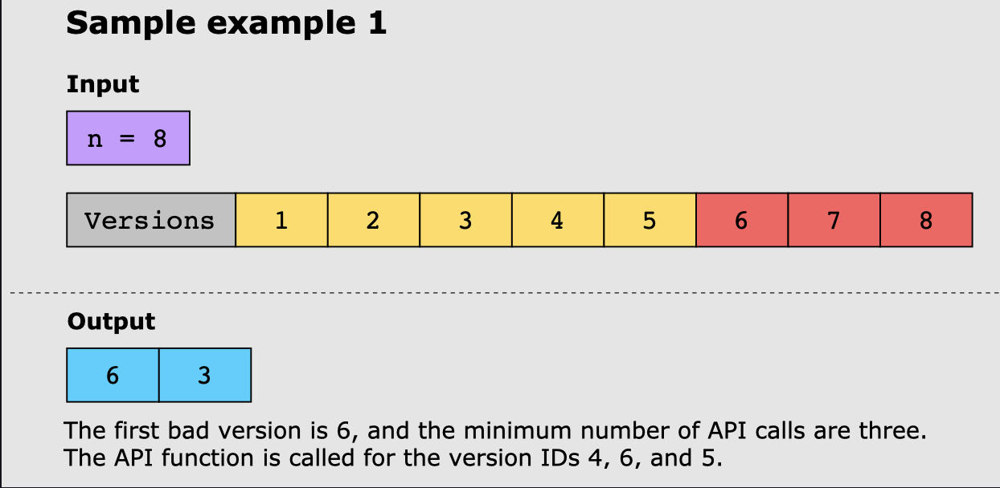

# Modified Binary Search

This pattern is an extension of the traditional binary search algorithm.

## Traditional Binary Search
This search algorithm is used for searching for a target value, i, in a sorted 
list that supports direct addressing (or random access). It follows a divide and
conqueror pattern which reduces the search space with each iteration. Three
pointers(indexes) are used: 

1. `start` - instantiated at the beggining of the list.
2. `end` - instantiated at the end of the list.
3. `middle` - instantiated in the middle of the list. 

Here are the steps assuming ascending order:
1. Set the first values of the indexes listed above. Middle can be calculated
   as the `start + end / 2`.
2. Check to see if `middle.value == i`. If so return true.
3. Compare `i` to `middle.value`. If `i` is less than `middle.value` update
   the `end` to `middle` and find the new middle. If `i` is greater than
   `middle.value` update the `start` to `middle` and find the new `middle`.
4. Continue steps 2/3 until you find the value you are looking for or if
   `start >= end`. If the latter return false. 

Binary Search operates at `O(log(n))` time since we divide the list in half at
each step.

```java
public int binarySearch(int[] nums, int target) {
 int left = 0;
 int right = nums.length - 1;
 int middle = 0;
 
 while (left <= right) {
    middle = right + left / 2;
    if (nums[middle] == target) {
       return middle;
    }
    // check left
    if (nums[middle] < target) {
        // Since we have already checked middle and this is our left pointer
        // we add one to middle and move it to the right.
        left = middle + 1;
     } else {
        // Since we have already checked middle and this is our right pointer
        // we subjctract one to middle and move it to the left.
        right = middle - 1;
     }
 }
 return -1;
}
```

## Modified Binary Search

The modified binary search pattern involves taking the traditional binary
search pattern and applying conditions or transformations. Some common
variations include: 

1. Binary Search on a modified array: The array might be sorted and then
   rotated around some unknown pivot. Or some element sin a sorted array might 
   be modified based on a condition. To handle these types of scenarios we can
   modify the basic binary search technique to identify anomalies in the
   sorted order.
2. Binary Search with multiple conditions: For example, finding a target range
   rather than a target value, finding the leftmost or right most occurrence of 
   a target value. 

## Example


## How to Know if Problem Matches this pattern
* The problem requires us to find a target value (or first or last occurrence)
  in a sorted list/array
* Can use this pattern when segments of an input are sorted, even if the whole
  list is not sorted. For example we can find a target in a sorted array that
  has been rotated around an arbitrary pivot. 
* The input array must support direct addressing.
* The sorted order must be in a way that is relevant for the search. For
  example if we are looking for a specific date in a list of dates sorted
  alphabetically this pattern will not work. 
* The solution must require us to find a particular value or range of values.

## Real World Problems
* *Dictionary(As in a book)*: We can use classic binary search to find words 
  quickly inside a dictionary. If we wanted to find all words that had a common
  prefix we could use a modified binary search. 
* *Debugging with minimal support*: If a code script consists of `n` lines, and
  there is a bug somewhere in the script. Binary Search is performed to find
  the bug by dividing the code based on line numbers. 
* *Student Documents*: Given a list of students sorted by their scores on a
  test, find all the students that scored between 40% and 55%. 

## Example Problems

### Search in Rotated Sorted Array

Given a sorted integer array, `nums`, and and integer target value, `target`
the array is rotated by some arbitray number. Search and return the index of
`target` in this array. If the `target` does not exist, return `-1`. 

Original Sorted Array: 
`|1|2|3|4|5|6|7|8|9|`

After rotating array 6 times:
`|7|8|9|1|2|3|4|5|6|`

```java
import java.util.*;
public class Main{
   public static int binarySearchRotated(List<Integer> nums, int target) {  
    int left = 0;
    int right = nums.size() - 1;
    int middle = 0;
    
    while (left <= right) {
       middle = right + left / 2;
       if (nums.get(middle) == target) {
          return middle;
       }
        // These variables/methods for tracking if the right and left are 
        // sourted are not required of course but helped me to break up the 
        // code while understanding it.
       boolean isSortedRight = false;
       boolean isSortedLeft = false;
       if (nums.get(middle) <= nums.get(right)) {
          isSortedRight = true;
       }
       if (nums.get(middle) >= nums.get(left)) {
          isSortedLeft = true;
       }
       if (isSortedLeft) {
          // If the target is within the sorted left hand side
        if (nums.get(left) <= target && target < nums.get(middle)) {
            // Drop the right
         right = middle -1;
      } else {
            // Drop the left since the item is not within the sorted left
         left = middle +1;
      }
   }
   if (isSortedRight){
           // If the target is within the sorted right
     if (nums.get(middle) < target && target <= nums.get(right)) {
            // Drop the left
      left = middle + 1;
   } else {
            // Drop the right since the item is not within the sorted right
      right = middle - 1;
   }
   
   
}
}
return -1;
}
}
```

### First Bad Version
The latest version of a software product has a bug in it. Since each version is
built upon the previous one, all the versions after the bad version are
considered bad. Suppose you have `n` versions with the ids: `[1,2,3,...,n]` and
you have access to an API function that returns `TRUE` if the argument is the
ID of a bad version. 

Find the first bad version that is causing all the later ones to be bad.
Additionally the solution should also return the number of API calls made
during the process and should minimize the number of API calls too. 



First Try:
This solution before works in the sense that it does find the first bad version
however it does make more calls than necessary to the `isBadVersion()` API.
```java
public class FBVersion{
   //This is a given method which I don't modify.
   static Api versionApi = new Api();

   public static boolean isBadVersion(int v){
      return versionApi.isBad(v);
   }
   
   public static int[] firstBadVersion(int n) {
      // -- GIVEN, DO NOT CHANGE THIS SECTION
      versionApi.n = n;
     // -- 

      int first = 1;
      int last = n;
      int apiCounter = 0;
      // We are doing a binary search here
      while (first < last) {
      int mid = (first + last) / 2;
      
      apiCounter++;
      // If the mid point is bad, drop the rest because we are looking for just
      // the first instance of bad.
      if (isBadVersion(mid)) {
         last = mid;
         apiCounter++;
         //I added a call here to check for the first bad version.
         if (!isBadVersion(mid - 1)) {
            return new int[]{mid, apiCounter};
         }
      } else {
      // Since the mid point is NOT bad we can drop the first half ot the list
      // because it will be all good. 
         first = mid+1;
      }

      }
      // This is never needed because we always have at least one good version
      // according to the constraints of the problem.
      return new int[]{0,0};
   }
}
```
Updated Version: 
This version removes some uneccessary calls to the `isBadVersion()` method.
```java
public class FBVersion{
   //This is a given method which I don't modify.
   static Api versionApi = new Api();

   public static boolean isBadVersion(int v){
      return versionApi.isBad(v);
   }
   
   public static int[] firstBadVersion(int n) {
      // -- GIVEN, DO NOT CHANGE THIS SECTION
      versionApi.n = n;
     // -- 

      int first = 1;
      int last = n;
      int apiCounter = 0;
      // We are doing a binary search here
      while (first < last) {
      int mid = first + (first + last) / 2;
      
      apiCounter++;
      // If the mid point is bad, drop the rest because we are looking for just
      // the first instance of bad.
      if (isBadVersion(mid)) {
         last = mid;
      } else {
      // Since the mid point is NOT bad we can drop the first half ot the list
      // because it will be all good. 
         first = mid+1;
      }

      }
      // Because we are always dropping the half of the list that is not bad
      // and the last half of the loop that IS bad we won't break out of the
      // loop until first == last. At that point we will have one item
      // remaining, the last good version.
      return new int[]{first, apiCounter};
   }
}
```

Here is an example for the case where you just want to know what the first bad
version is. 

```java

    public int firstBadVersion(int n) {
        int first = 1;
        int last = n;

        while (first < last) {
            // Calculating mid was a bit tricky for me to understand at first.
            // First let us understand the (last - first) / 2 part:
            // Java always truncates the result of Integer division so here if 
            // you have first = 1 and last = 20 you will get:
            // 1 + (19 / 2) = 1 + 9
            // Can also think of it as how many times does 2 fit into 19.

            // Now for the addition of first to this number. We are looking for the
            // first bad version number. So our while loop is iterating while first is
            // less than last. This means when we will break out of the loop when the 
            // first = the first bad version. (walk through a small example and you
            // will see)
            int mid = first + (last - first) / 2;
            if (isBadVersion(mid)) {
                last = mid;
            } else {
                first = mid + 1;
            }
        }
        return first;
    }
```
