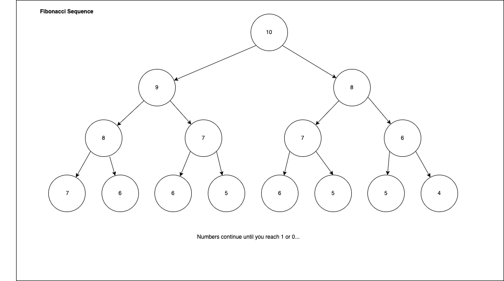

# Recursion

When talking about recursion in Computer Science you are usually referring to
the process of breaking a problem down to its base case, solving it and then
using the results to arrive at your original solution. 

The factorial function is a classic example: 
```java
public int factorial(int n) {
   if (n > 0) {
       return n * factorial(n-1);
   } else {
       return 1;
   }
}
```

You can solve almost any problem iteratively that is solved recursively but
there are pros/cons of doing so. 

# Dynamic Programming
Dynamic Programming is breaking a problem down into simpler sub-problems in a
recursive way. You can also do this iteravely with a Stack. 

To solve a problem with Dynamic Program you must have: 
1. A optimal substrucuture - That is the sub-problems you broke the problem up
   into can be combined to produce the solution. Usually these problems are
   defined via recursion. 
2. Overlapping Subproblems - These sub problems should be small and should be
   the same problems or a Set of the same problems solved over and over again
   so you can take advantage of this and cache the solution to the problem. 

There are two different approaches in dynamic programming you can use to solve
a problem, the Top Down Approach with Memoization, and the Bottom-up approach
with tabulation.

### How to form a solution using Dynamic Programming
Assuming your problem meets the qualifications above you should follow these
three steps to define your solution. 
1. Express the problem in terms of indexes. 
2. Try out all possible choices at a given index.
3. Return (`taken || notTaken`)


## Top Down Approach with memoization
Here we store all the results of the solved subproblems in an array or hash
map. That way whenever we encounter an overlapping subproblem during recursion
we can just refer to it instead of re-doing it.


### Fibonacci Example

Will use the Fibonacci Example to show both. Will start with the basic
recursive implementation which is very very slow.

Code for Recursive Implementation:

```java
public int fibRecursive(int in) {
    if (n <= 1) {
        return n;
    } else {
        return fibRecursive(n - 1) + fib(n - 2);
    }

}
```

The runtime of the `fibRecursive` method is not as straightforward as it looks.
It is O(2^n) due to the fact that you are making about that many calculations
with all the recursive calls you are making. 

When you write this problem out in a graph of recursive calls for a number like
10 you will see that there are many common problems being solved:



If you cache these solutions instead of calculating them you can drastically
reduce the runtime of the function. 

#### Top Down Dynamic Programming Solution

```java
public int fibDynamidProgramming(int n) {
    return fibDynamicProgramming(n, new int[n];
}

public int fibDynamicProgramming(int n, int[] array) {
    if (n <= 1) {
        return n;
    } else {
        if (array[n] == 0) {
            array[n] = fibDynamicProgramming(n - 1, array) +
            fibDynamicProgramming(n - 2, array);
        } 
        return array[n];
    }
}
```

## Bottom-up Approach with tabulation
This approach allows us to use recursion in a different way. We use an
n-dimensional array to store the results of the sub problems. On some problems
this may require computing using two-dimensional arrays or one dimentional
arrays with a twist. It can be tricky and isn't always a good idea for dynamic
programming problems.

### Bottom Up Dynamic Programming Solution

Start calculating the sums from the bottom and move up to n.

```java
public int fibDynamidProgrammingBottomUp(int n) {
    if (n <= 1) {
        return n;
    } else {

    int [] array = new array[n];
    array[0] = 0;
    array[1] = 1;
    for (int i = 2; i < n; i++) {
        array[i] = array[i - 1] + array[i - 2];
    }
    return array[n - 1] + array[n - 2];
}
```

Depending on the problem it may be easier to think of this in one direction or
the other.

## Generating Subsequences with Recursion
This is a common pattern that is often used modified to generate subsequences.

**Problem:** Given an array of Integers, generate all possible *Subsequences*(A
sequence that can be dirived from a given sequence by deleting some or no
elements without changing the order of the remaining elements). 

**Example:** 
Given: `[3,1,2]` as the input. 

Output: `{[], [3,1,2], [3,1], [3,2], [3], [1,2], [1], [2]}`

### Implementation in Java
```java
public class GenerateSubsequences {

    static ArrayList<int[]> results = new ArrayList<>();
    /**
     * Given an array of integers return a list of all the possible
       subsequences which could be made from it.
     */
    public static ArrayList<int []> generateSubSequences(int [] numberArray) {
        ArrayList<Integer> buildingArray = new ArrayList<>();
        recGenerateSubSequences(0, numberArray, buildingArray);
        return results;
    }
    private static void recGenerateSubSequences(int index, int [] numberArray, ArrayList<Integer> subSequence) {
       // Base Case: if we get to the end of the list we are done generating a new subsequence
        System.out.println("Current index: " + index);
        System.out.println("Current subsequence: " + subSequence);
       if (index >=  numberArray.length) {
           results.add(subSequence.stream().mapToInt(i -> i).toArray());
           return;
       }
       subSequence.add(numberArray[index]);
       // Generate subsequences while "taking" the current index
       recGenerateSubSequences(index + 1, numberArray, subSequence);
       // We remove the current index because we are not taking it.
       subSequence.remove(subSequence.size() - 1);
       // Here we are "not taking" the item at the current index
       recGenerateSubSequences(index + 1, numberArray, subSequence);

    }
}
```

## Partition Equal Subset Sum

**Problem:** Given an integer array , return true if you can partition the 
             array into two subsets such that the sum of the elements in both 
             subsets is equal or false otherwise.

```java
/**
 * Problem: Given an integer array return `true` if you can partition the array 
 *          into two subsets such that the sum of the elements in both subsets 
 *          is equal or `false` if otherwise.
 */
public class PartitionEqualSubsetSum {
    static Boolean[][] mem;
    static ArrayList<int []> results;
    public static Boolean [][] canPartition(int[] numberArray) {
        results = new ArrayList<>();
        int length = numberArray.length;
        int sum = 0;
        //Determine sum of all numbers
        for (int i: numberArray) {
            sum = sum + i;
        }
        // If the sum is odd we can't partition the list
        if (sum % 2 != 0) {
            return mem;
        }

        // We are dividing the sum in 2 because we just need to find one 
        // subsequence which is sum/2 because the sum of the other elements 
        // must be equal to sum/2 as well.
        sum = sum / 2;

        // Here we are storing the results for each partition.
        // The index of the first array will always between 0 and the length of
        // the array since it is storing the validity of the result.
        // The second array, will be anywhere between 0 and the sum since the 
        // sum will always be at the most its current value.
        mem = new Boolean[length][sum + 1];

        boolean result = determineSubSetSum(numberArray, 0, sum);
        return mem;
    }

    private static boolean determineSubSetSum(int[] numberArray, int position, int sum) {
        // Base case, we have found the sum that adds up to this value in a 
        // previous iteration `sum - numberArray[position]` has passed 0 into 
        // the method.
        if (sum == 0) {
            return true;
        }
        // If we have reached the end of the array while the sum is not <= 0
        // return false, we can't do it.
        else if (position >= numberArray.length || sum < 0) {
            return false;
        }
        // Use our memoization
        if (mem[position][sum] != null) {
            return mem[position][sum];
        }
        // These two calls are where we are recursively creating subsequences 
        // of the array. Here we are making a call where we do take the current
        // item. We are "taking" it by removing it from the sum.
        return mem[position][sum] = determineSubSetSum(numberArray, position + 1, sum - numberArray[position]) ||
        // Here we are first making a call where we don't take the current 
        // item, we move to the next position but subtract the current item 
        // value from the sum.
                                    determineSubSetSum(numberArray, position + 1, sum);

    }
}
```
