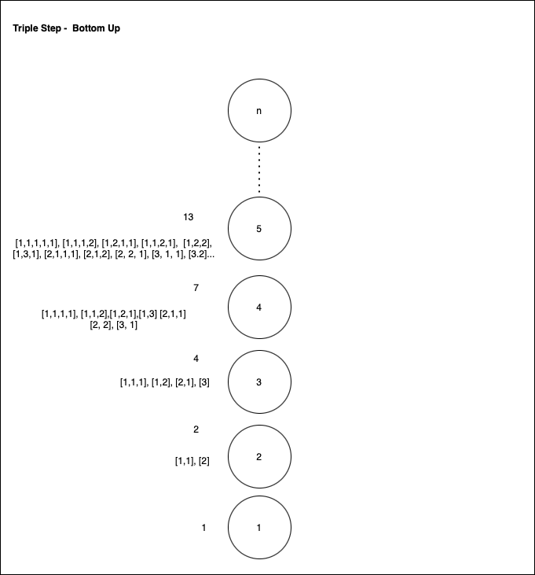

# Triple step

## Description
Given a staircase of n steps, write a program that will provide the number of
ways a child could get up the steps given they could go 1, 2, or 3 steps at a
time. 

## Solution
If you look at a few examples you will see that the number of ways you can get
up a staircase of n steps is the number of ways you can get up steps of size
(n-1) + (n-2) + (n-3). 

## Picture

