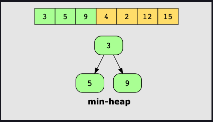
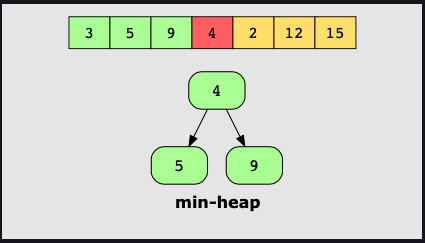
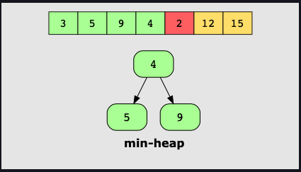
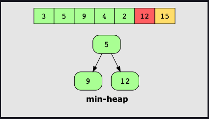
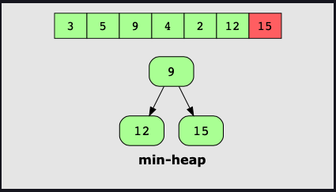

# Top K Elements
This pattern helps find some specific `k` number of elements from the given
dataset with optimum time complexity. 

Many problems ask for the top, smallest, most/least frequent `k` elements in an
unsorted list. Normally you would sort the list, taking `O(nlog(n))` time, then
find the `k` elements taking `O(k)` time. However the following pattern can
help us solve the problem in `O(nlog(k))` time without sorting the list first.

This pattern uses MaxHeaps or MinHeaps to do so.

For example: Find the top `k` largest(or smallest) elements of a list. 

1. Insert the first k elements from the given set of elements to the
   max-heap(or min-heap if smallest). 
2. Iterate through the rest of the elements. 
    a. for min-heap, if you find the larger element, remove the top (smallest
    number) of the min-heap and insert the new larger element.
    b. for max-heap, if you find the smaller element, remove the top (largest
    number) of the max-heap and insert the new smaller elemement. 

Iterating gthe complete list takes `O(n)` time, and the heap takes `O(log(k))`
time for insertion however we get `O(1)` acces to the k elements using the
heap.

In picture form: 







## How to Know if Problem is of this type

* We need to find the largest, smallest, most frequent, or least frequent
  subset of elements in a sorted list. 
* This may be the requirement of the final solution or an intermediate step
* The input data structure supports random access. 
* The input data is not sorted according to the criteria relevant to solving
  the problem. 
* `k != 1`

## Real World Examples

* *Uber*: Select at least the `n` nearest drivers within the user's vicinity,
  avoiding the drivers that are too far away. 
* *Stocks*: Given the set of IDs of brokers, determine the top K broker's
  performance with the frequently repeated IDs in the given data set.

## Non-real world examples
* Sort the characters of a string by frequency.
* Implement a stack in which the pop operation removes the most frequent
  element.

## Example Problems

### K'th Largest Element in a Stream
Given an infinite stream of integers, `nums`, design a class to find the k'th
largest element in a stream. 

The class should have the following functions, inputs, and return values:

* `Init()`: Takes an array of integers and an integer `k` and initializes the
  class object. 
* `Add(value)`: Takes one integer value, appends it to the stream and calls the
  `ReturnKthLargest()`: Returns an integer value that represents the `kth`
  largest element in the stream. 

#### Constraints
* 1 <= k <= 10^3
* 0 <= nums.length <= 10^3

#### Solution
For `Init()`:
1. Create a MinHeap and push the first k items froms nums onto it. 
2. Iterate throught he remaining items in the list. If the number on the top of
   the heap is < the number you are looking at. Add that number to the list and
   then remove the item on the top of the heap. If it is not, do nothing.
For `Add(value):
1. Add Value to Minheap, remove the now top item from the Heap. Call
   `returnKthLargest ();
For `returnKethLargest()`: 
1. call `peek()` on the minheap and return result. 


```java
class KthLargest {
  PriorityQueue<Integer> minHeapOfTopK;
  // constructor to initialize minHeapOfTopK and add values in it
  public KthLargest(int k, int[] nums) {
    minHeapOfTopK = new PriorityQueue<Integer>();

    //Add first k items to heap.
    for (int i = 0; i < k; i++) {
      minHeapOfTopK.add(nums[i]);
    }

    //Add remaining items.
    for (int j = k; j < nums.length; j++) {
      if (nums[j] > minHeapOfTopK.peek()) {
        minHeapOfTopK.add(nums[j]);
        //Remove whatever is the lowest item now as we want k items in this
        //heap
        minHeapOfTopK.poll();
      }
    }
  }
  // adds element in the minHeapOfTopKHeap
  public int add(int val) {
    if (minHeapOfTopK.peek() < val) {
      minHeapOfTopK.add(val);
        //Remove whatever is the lowest item now as we want k items in this
        //heap
      minHeapOfTopK.poll();
    }
    return minHeapOfTopK.peek();
  }
  // returns kth largest element from minHeapOfTopKHeap
  public int returnKthLargest() {
    
    return minHeapOfTopK.peek();
  }
}
```

Solution above should include null checks/validation on the constructor as
needed. Left those out as I am practicin implementing the algorithm not writing
something that is actual prod code. 

*Time Complexity*
Constructor - `O(nlog(n))` - As that is what it takes to add every item to the
heap. 

Add - `O(logk)` to add an element to a heap size of k

ReturnKthLargest - `O(1)` since we are peeking at the top of the heap. 

# Reorganize String
Given a string, str, rearrange it so that any two adjacent characters are not
the same. If such a reorganization of the characters is possible, output any
possible valid arrangement. Otherwise, return an empty string.

## Solution
1. Store each character and its frequency in a HashMap. HashMap<Character,
   Frequency>. 
2. Construct a max-heap using the character frequency data. So that the most
   frequently occurring character is at the root of the heap.
3. Iterate over the heap and in each iteration, pop the most frequently
   occuring character and append it to the result string.
4. Decrement the frequency of the popped character, (since we have consumed one
   occurence of it). 
5. Push the popped character back onto the heap in the next iteration if the
   updated frequency is greater than 0. If at this point the Heap is empty but
   the updated frequency for that character is greater than 0, return empty
   String. Else...
6. Return the result string when the heap becomes empty.

```java
  public static String reorganizeString(String string1) {
  //Create Map of Strings and their Frequency (This was my first thought)
  // HashMap<String, Integer> characterFrequencyMap = new Hashmap();

  // for(int i = 0; i < string1.length(), i++){
  //   String currentChar = string1.getChar(i);
  //   if (characterFrequencyMap.get(currentChar)) == null) {
  //     characterFrequencyMap.add(currentChar, 1);
  //   } else {
  //     charFrequencyMap.add(currentChar, 
  //       characterFrequencyMap.get(currentChar) +1);
  //   }
  // }

  // I realized later I could do like so:
  HashMap<Character, Integer> characterFrequencyMap = new HashMap<Character, Integer>();
  for(char c: string1.toCharArray()) {
    int freq = characterFrequencyMap.getOrDefault(c, 0 ) + 1;
    characterFrequencyMap.put(c, freq);
  }

  //Create a MaxHeap using the frequency data for the characters
  PriorityQueue<Map.Entry <Character, Integer>> maxFreqChars = 
    new PriorityQueue<Map.Entry<Character, Integer>> (
      (a, b) -> b.getValue() - a.getValue());

  maxFreqChars.addAll(characterFrequencyMap.entrySet());

  Map.Entry<Character, Integer> previous = null;
  StringBuilder result = new StringBuilder(string1.length());

  while (!maxFreqChars.isEmpty() || previous != null) {
    //Can't make a reorginized String
    if (maxFreqChars.isEmpty() && previous != null) {
      return "";
    }
    Map.Entry<Character, Integer> current = maxFreqChars.poll();
    result.append(current.getKey());
    int currentFreq = current.getValue() - 1;

    if (previous != null) {
        maxFreqChars.add(previous);
        previous = null;
    }
    if (currentFreq != 0) {
      previous = new AbstractMap.SimpleEntry<>(current.getKey(), currentFreq);

    }
  }

    return result.toString();
}
```


