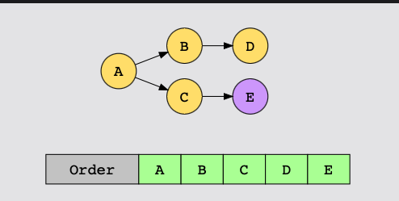
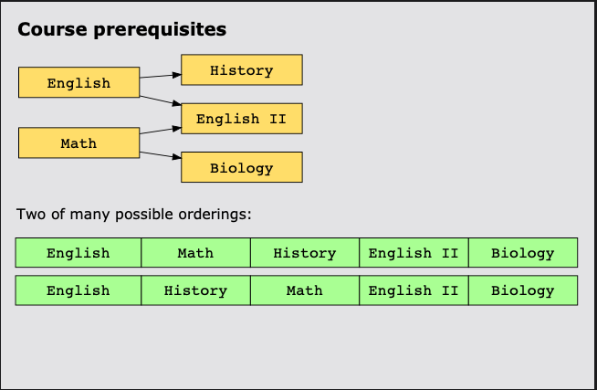
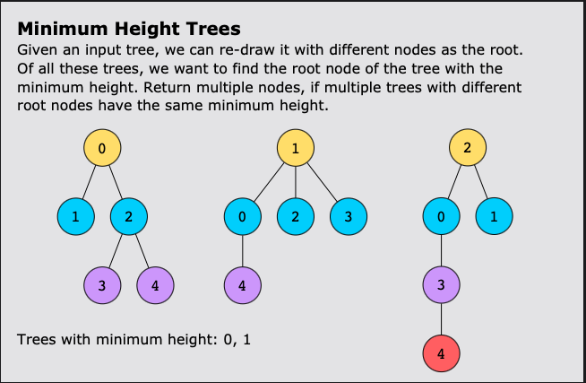

# Topological Sort
This is a pattern used to find valid orderings of elements that have
dependencies on or priority of each other. Scheduling and grouping problems
that have prerequisites or dependencies generally fall under this pattern.

A topological sort can be described as a partial order. There is flexibility in
that there can be multiple correct orders. For example ordering integers like
`[87,12, 93, 2, 56,]` has only one correct ascending order. `[2, 12, 56, 87, 93]`.
But if you consider determining the order in which you are going to take some
classes where English I has to be taken before English II and Mathematics can
be taken at any part your possible correct solutions could be: 

* English I, English II, Mathematics
* Mathematics, English I, English II
* English I, Mathematics, English II

Converting the problem to a directed graph is the first step to finding a
solution. The elements to consider correspond to graph vertices and dependency
relationships form the edges. A valid topological order exists if the graph is
**acyclic** - This means the graph never has a cycle in it. 

## Examples

## How do I know if my problem matches this Pattern?

* A partial ordering(not total) of the given elements is required.
* The problem asks you to find an ordering of elements based on some dependency
  rules between them.
* Must be able to convert the relationships to a graph, this graph must be a
  tree.

## Real-world Problems

Topological sort can be used for process scheduling in a computer system. When
a system starts up a number of processes must be started. Some processes have
dependencies on each other specified in ordered pairs of the form (a,b). There
can not be any cyclic dependencies (a,b), (b,a) for example. In order to
successfully start a system must create an order that the processes run in
where all dependencies are met.

