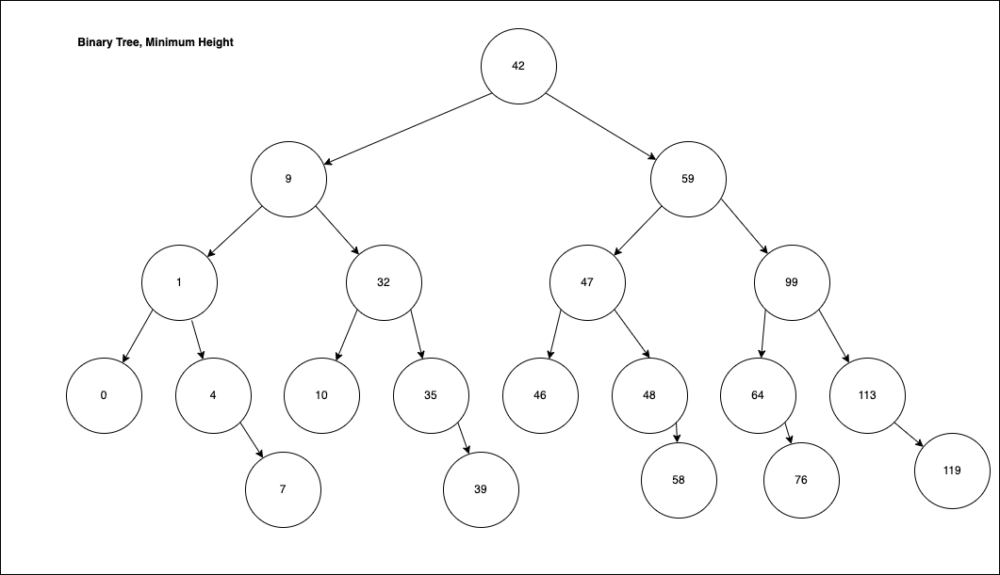

# Minimal Tree
Adding a bit more of a description here to help describe how this problem is
solved.

## Problem
Given an ordered array of integers produce a Binary Search Tree of minimal
height.

## Example
```
int [] input = {0,1,4,7,9,10,32,35,39,42,46,47,48,58,59,64,76,99,113,119}
```

Should produce:



