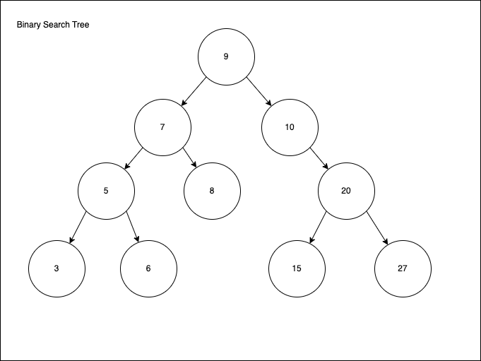
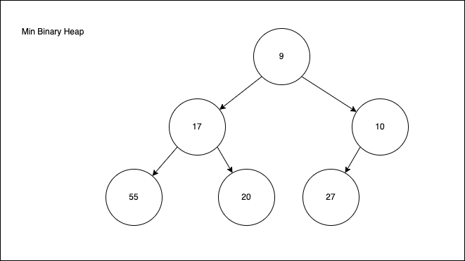
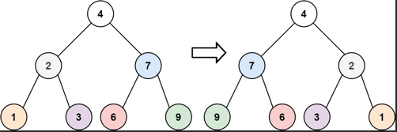
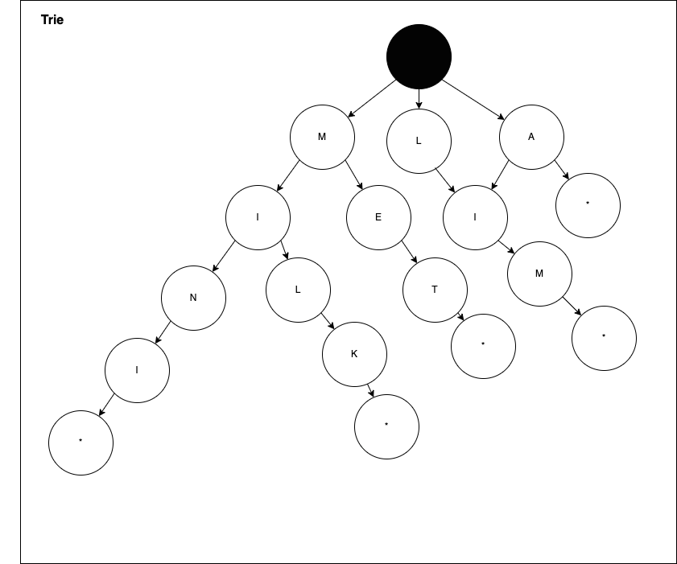

# Trees

A tree is a Data Structure made up of Nodes.

Nodes look somehting like: 

```java
public Node {
    int value; // This could be a String, Integer, or any Object
    Node []; // These are the Nodes that are children of this node
}
```

Binary trees usually have two Nodes instead of the array since they always have
at most two childeren. Usually these are labled `Node left` and `Node right`.

## Binary Search Tress
Binary Search trees are Binary trees that are sorted in a way in which all
values in the left node, including all children of those nodes, are less than
the value in the parent node. And all values in the right node of each node and
its children are greater than the parent node. In this way each node is seen as
a parent node.

Example:



### Binary Tree Traversal

There are three common ways of traversing a Binary Tree.

1. In-Order Traversal:

```java
void inOrderTraversal(Node node) {
    while(node!= null) {
        inOrderTraversal(node.left);
        access(node); // Note this is the operational step(printing, processing,
                      // etc.
        inOrderTraversal(node.right);
    }
}
```

2. Pre-Order Traversal:

```java
void preOrderTraversal(Node node) {
    while (node!= null) {
        access(node);
        preOrderTraversal(node.left);
        preOrderTraversal(node.right);
    }
}
```

3. Post-Order Traversal:

```java
void postOrderTraversal(Node node) {
    while (node!= null) {
        postOrderTraversal(node.left);
        postOrderTraversal(node.right);
        access(node);
    }
}
```

Because these are ordered Binary search trees we can see that the operational
step will take place in either the "order" or as you walk through the tree in
order. Or after you have already walked all the way through the tree.

## Binary Heaps
Binary Heaps are Binary trees (NOT Binary Search Tress) that are "Complete
Binary Trees". Complete Binary Trees are trees that have two nodes for every
node except for perhaps the last level of the tree. 

Example of Complete Binary Tree: 


### Min/Max Binary Heaps
Each Node is Smaller than its children and the top most parent node is the
smallest in the tree. (Change min to Max for Max Heaps).




Binary Heaps are usually stored in an array and this is how you can access the 
elements in it. 

For the first element it is always in Arr[0], its left node in Arr[1] and right
node in Arr[2]. 

For all other nodes you can follow this forumula:

|Array Location|Description|
|-----------|-----------|
|Arr[i]|The Node|
|Arr[(i-1)/2]|Returns the Parent Node of the Node|
|Arr[(2*i) +1|Returns the left child node|
|Arr[(2*i) +2|Returns the right child node|

The calculation of the array location is done with integer math, no fractions
returned. 

#### Inserting into Min/Max Heap
You alway insert at the bottom of the heap looking left to right most on the
items so the completness of the tree is maintained. You then bubble up the
minimum element to maintain the trees sorting. This is a `O(log n)` operation
where n is the number of nodes. 

#### Extract Minimum Item
You take the rightmost item at the bottom of the list and replace the old
minimum with it. Then you Compare the children of the list and swap places with
the least item. You continue to do this until the tree is in the state where
every parent is smaller than both of its children. This is also a `O(log n)`
operation. 


#### Inverting Binary Tree
Given the `root` of a binary tree, invert the tree, and return its root. 



This problem has a pretty simple soltution using recurssion. Simply create a
function which reverses the left and right of each node until you get to a null
node. 

```java
/**
 * Definition for a binary tree node.
 * public class TreeNode {
 *     int val;
 *     TreeNode left;
 *     TreeNode right;
 *     TreeNode() {}
 *     TreeNode(int val) { this.val = val; }
 *     TreeNode(int val, TreeNode left, TreeNode right) {
 *         this.val = val;
 *         this.left = left;
 *         this.right = right;
 *     }
 * }
 */
 /** 
  * 1. Use recursion to do this. Create a function that given a node switches the left and the right. 
  * 2. Base case is if the node pased in is null return. 
  */
class Solution {
    public TreeNode invertTree(TreeNode root) {

        invertTreeRec(root);
        return root;
        
    }
    public void invertTreeRec(TreeNode node) {
        if(node == null) {
            return;
        } 
        TreeNode temp = node.left;
        node.left = node.right;
        node.right = temp;
        invertTreeRec(node.left);
        invertTreeRec(node.right);
    }
```

## Tries
Tries are a type of tree that are commonly used to store words. Each node
stores a character and the end of each word has a character like `*` at it
which denotes it is the end of a word. 

Example:



Tries are commonly used in predictive text completion (autocomplete) or other
similar functionality where lookups are done in real time on a trie that has
the entire English language in it. 

A try can look up a string in O(n) time where n is the number of characters in
the word. The same speed of a Hashtable (in the worst case). 

## Graphs
A tree is a type of graph. A graph is a collection of nodes with edges between
some of them. 

### Adjacency List
Every vertex or node stores a list of vertices. A node looks just like a trees
node:

```java
public Node {
    int value; // This could be a String, Integer, or any Object
    Node [] children; // These are the Nodes that are children of this node
}
```

The Graph class will actually be useful though unlike a "Tree" class since we
don't have a root in a graph to derive the rest of the nodes from.

```java
public class Graph {
    public Node[] nodes; // All of the nodes in this graph. 
}
```

### Adjacency Matrices
A N X N boolean matrics, n is the number of nodes. A true value at the matrix
point means there is a node there. matrix[i][k] for example. 

Determining neighbors with a Adjacency List is easier due to having the list
right on the node but an Adjacency Matrix makes it easier to test if there is
an edge between two given vertices.

### Graph Search

#### Depth-first Search
Start at the root and visit each branch completely before checking the next
branch. You go "deep" into the data structure first.

This method is often preferred if you want to visit every node in the graph.

```java
void depthFirstSearch(Node root) {
    if (root==null) {
        return;
    }
    access(root); //Do operation 
    root.visited = true;
    for(Node e : root.children) {
        if (!(e.visited) {
            depthFirstSearch(e);
        }
    }
}
```

#### Breadth-first Search
You start at the root and visit each neighbor before going to their children.
You go "wide" into the search before going deep. 

This method is preferred if you want to find every path or the shortest path in
the graph.


```java
void breadthFirstSearch(Node root){
    Queue<Node> queue = new LinkedList();
    root.marked = true;
    queue.add(root);

    while (!queue.isEmpty()) {
        Node r = queue.poll();
        visit(r); //Do operation
        for (Node e: root.children) {
            if (e.marked == false) {
                e.marked = true;
                queue.add(e);
            }
        }
    }

}
```

##### Bidirectional Search
This search is done using two breadth-first searches. You are looking for the
shortest path between two nodes. You start one breadth-first search from each
node and end when they meet.

Note: If your graph is directional you search forward from one and backward
from the other.
