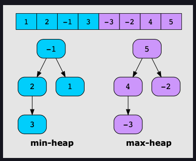
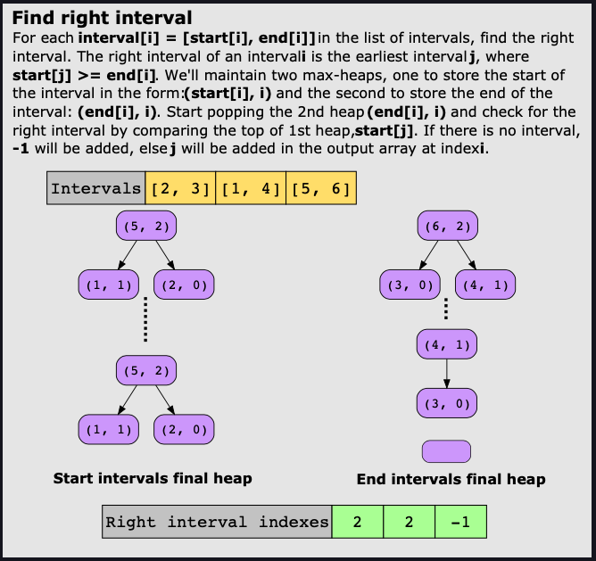
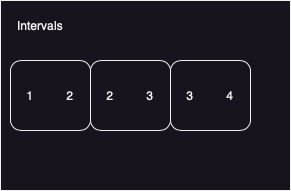
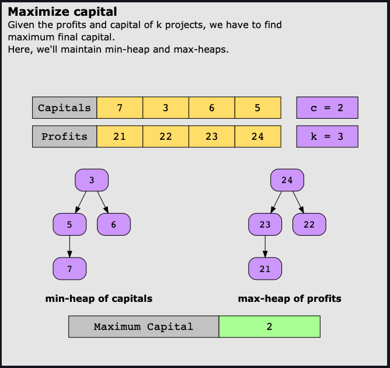

# Two Heaps
This pattern uses either two min-heaps, two max-heaps, or a min-heap and a
max-heap simultaneously to solve a problem. 

---
*Heap Definition Reminder*

A "heap" is a specialized
tree-based data structure that satisfies the heap property: 

* If it is max heap, the key at the root node is always greater than or equal
  to the keys at the children nodes. 
* If it is a min heap, the key at the root node is always less than or equal to
  the keys at the children nodes. 

Heaps are useful for implementing priority queues and applications like
sorting algorithms. The basic operations are:
* `insert()` - addes a new key to the heap.
* `extractMin()` or `extractMax()` - Removes the min/max key key from the heap
  depending on if it is a min or max heap. 
* `decreaseKey()` - decreases the value of a key in the heap. 
* `buildHeap()` - Buildes a heap from an array of keys. 
* `heapify()` - converts a binary tree into a heap. 

You can use an array or a binary tree to implement a heap. Array implementation
is more space efficient while binary tree implementation allows for faster
extraction of the min/max. 



In Java the [Priority
Queue](https://docs.oracle.com/javase/8/docs/api/java/util/PriorityQueue.html)
is a good collection to use which implements both min and max heaps. 

Below I will show how a Priority Queue (Min Heap) can be created from an array of
integers. The heap will store the values in an array for each, the first value
is the value in the array, the second it's index.

```java
// Initializing a new priority queue with a comparator that compares the first 
// value in one array (which is the value we will store in the comparator) with
// the first value in another array.
PriorityQueue<int[]> minHeapCapitals = new PriorityQueue<>((a,b) -> Integer.compare(a[0], b[0]));
// Our input array
int [] arrayOfInts = {2,1,2,3};

// Populating the PriorityQueue
for(int i = 0; i < arrayOfInts.length; i++) {
    minHeapCapitals.offer(new int [] {arrayOfInts[i], i});
}
System.out.println("Printing entire min heap!");
minHeapCapitals.forEach(item -> System.out.println(Arrays.toString(item)));
System.out.println("Finished Printing!");
```

**Output:**
```
Printing entire min heap!
[1, 1]
[2, 0]
[2, 2]
[3, 3]
Finished Printing!
```

---


If there are `n` elements in a heap it takes `O(logn)` time to insert an
element in it. `O(logn)` time to remove an element from it and `O(1)` time to
remove it. 

In some problems we are given a set of data that can be divided into two
groups. We can then place those groups in a Max Heap if we are looking for the
maximum value from it, or Min Heap if we are looking for the minimum or perhaps
if we just have one data set but need both the min and the max from the dataset
we put the data set into both a Min and a Max Heap. 

## Examples

### Find Right Interval

Given an array of intervals where `intervals[i] = [[start, end], [start,
end]...]` and each `start` is unique. The **right interval** for an interval
`i` is an interval `j` such that `start(j) >= end(i)` and `start(j)` is
minimized. Note that `i` may equal `j`.

Return an array of right interval indices for each interval `i`. If no right
interval exists for interval `i` then put `-1` at index i.

#### Example 1
**Input**: [[2,3], [1,4], [5, 6]]  
**Output**: [2, 2, -1]  
**Explanation**:   



#### Example 2

**Input**: [[2,3], [1,2], [3, 4]]  
**Output**: [2, 0, -1]  
**Explanation**: For the first interval [2,3] the closest rightmost interval is
the last interval [3,4] which is in index 2. for [1, 2] the closest right most
interval is the first interval [2,3]. See picture below for more context.



#### Maximize Capitals


## Real World Examples
Video Streaming: During a user session, there is often a possibility that
packaet drops and buffering might occur. We want to record the median number of
bufferring events that might occur in a particular session, which could then be
used to improve the user experience.

Netflix: As a part of a demographic study, we could be interested in teh median
age of our viewers. We wan tto implement a functionality whereby the median age
can be updated efficiently whenever a new user signs up for video streaming.

#### Maximize Capitals Problem
A busy investor with an initial capital, c, needs an automated investment
program. They can select k distinct projects from a list of n projects with
corresponding capitals requirements and expected profits. The goal is to
maximize their cumulative capital by selecting a maximum of k distinct projects
to invest in, subject to the constraint that the investor’s current capital
must be greater than or equal to the capital requirement of all selected
projects.

c - initial capital
k - number of projects selected
n - number of potential projects

##### Example

**Input**: n = 4, k = 2, c = 1
Capitals:
|1|2|2|3|

Profits:
|2|4|6|8|

Selected captials: 1, 3

Selected Profits: 2, 8

Maximum Capital: 1 + 2 + 8 = 11


##### Solution


