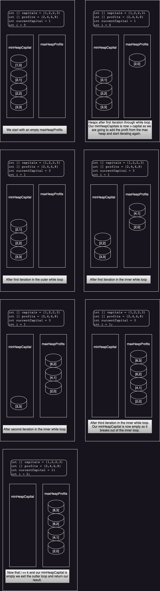

# Two Heaps
This pattern uses either two min-heaps, two max-heaps, or a min-heap and a
max-heap simultaneously to solve a problem. 

---
*Heap Definition Reminder*

A "heap" is a specialized
tree-based data structure that satisfies the heap property: 

* If it is max heap, the key at the root node is always greater than or equal
  to the keys at the children nodes. 
* If it is a min heap, the key at the root node is always less than or equal to
  the keys at the children nodes. 

Heaps are useful for implementing priority queues and applications like
sorting algorithms. The basic operations are:
* `insert()` - addes a new key to the heap.
* `extractMin()` or `extractMax()` - Removes the min/max key key from the heap
  depending on if it is a min or max heap. 
* `decreaseKey()` - decreases the value of a key in the heap. 
* `buildHeap()` - Buildes a heap from an array of keys. 
* `heapify()` - converts a binary tree into a heap. 

You can use an array or a binary tree to implement a heap. Array implementation
is more space efficient while binary tree implementation allows for faster
extraction of the min/max. 


In Java the [Priority
Queue](https://docs.oracle.com/javase/8/docs/api/java/util/PriorityQueue.html)
is a good collection to use which implements both min and max heaps. 

Below I will show how a Priority Queue (Min Heap) can be created from an array of
integers. The heap will store the values in an array for each, the first value
is the value in the array, the second it's index.

```java
// Initializing a new priority queue with a comparator that compares the first 
// value in one array (which is the value we will store in the comparator) with
// the first value in another array.
PriorityQueue<int[]> minHeapCapitals = new PriorityQueue<>((a,b) -> Integer.compare(a[0], b[0]));
// Our input array
int [] arrayOfInts = {2,1,2,3};

// Populating the PriorityQueue
for(int i = 0; i < arrayOfInts.length; i++) {
    minHeapCapitals.offer(new int [] {arrayOfInts[i], i});
}
System.out.println("Printing entire min heap!");
minHeapCapitals.forEach(item -> System.out.println(Arrays.toString(item)));
System.out.println("Finished Printing!");
```

**Output:**
```
Printing entire min heap!
[1, 1]
[2, 0]
[2, 2]
[3, 3]
Finished Printing!
```

---


If there are `n` elements in a heap it takes `O(logn)` time to insert an
element in it. `O(logn)` time to remove an element from it and `O(1)` time to
remove it. 

In some problems we are given a set of data that can be divided into two
groups. We can then place those groups in a Max Heap if we are looking for the
maximum value from it, or Min Heap if we are looking for the minimum or perhaps
if we just have one data set but need both the min and the max from the dataset
we put the data set into both a Min and a Max Heap. 

## Real World Examples
Video Streaming: During a user session, there is often a possibility that
packaet drops and buffering might occur. We want to record the median number of
bufferring events that might occur in a particular session, which could then be
used to improve the user experience.

Netflix: As a part of a demographic study, we could be interested in teh median
age of our viewers. We wan tto implement a functionality whereby the median age
can be updated efficiently whenever a new user signs up for video streaming.

## Examples

### Problem: Find Right Interval

Given an array of intervals where `intervals[i] = [[start, end], [start,
end]...]` and each `start` is unique. The **right interval** for an interval
`i` is an interval `j` such that `start(j) >= end(i)` and `start(j)` is
minimized. Note that `i` may equal `j`.

Return an array of right interval indices for each interval `i`. If no right
interval exists for interval `i` then put `-1` at index i.

#### Example 1
**Input**: [[2,3], [1,4], [5, 6]]  
**Output**: [2, 2, -1]  
**Explanation**:   


#### Example 2

**Input**: [[2,3], [1,2], [3, 4]]  
**Output**: [2, 0, -1]  
**Explanation**: For the first interval [2,3] the closest rightmost interval is
the last interval [3,4] which is in index 2. for [1, 2] the closest right most
interval is the first interval [2,3]. See picture below for more context.


### Problem: Maximize Capitals


A busy investor with an initial capital, c, needs an automated investment
program. They can select k distinct projects from a list of n projects with
corresponding capitals requirements and expected profits. The goal is to
maximize their cumulative capital by selecting a maximum of k distinct projects
to invest in, subject to the constraint that the investor’s current capital
must be greater than or equal to the capital requirement of all selected
projects.

c - initial capital
k - number of projects selected
n - number of potential projects

#### Example

**Input**: n = 4, k = 2, c = 1
Capitals:
|1|2|2|3|

Profits:
|2|4|6|8|

Selected captials: 1, 3

Selected Profits: 2, 8

Maximum Capital: 1 + 2 + 8 = 11


#### Solution

```java
  public static int maximumCapital(int c, int k, int[] capitals,int[] profits) {
      int currentCapital = c;
         //Initialize the Priority Queue, a min heap for the captitals array
         PriorityQueue<int[]> minHeapCapitals = new PriorityQueue<>((a,b)-> a[0] - b[0]);
         //Add all the capitals to the 
         for(int i = 0; i < capitals.length; i++) {
            minHeapCapitals.offer(new int [] {capitals[i], i});
         }
         // Initialize another Priority Queue, a max heap for the profits 
         PriorityQueue<int[]> maxHeapProfits = new PriorityQueue<>((a,b)-> (b[0]- a[0]);

         int i = 0;
         // Choose Projects with the maximum profit until we get to the project
         // limit.
         while(i < k) {
            // While the capital's minheap still has items in it and the smallest
            // item in the heap is less than or equal to the currentCapital..
            while(!minHeapCapitals.isEmpty() && minHeapCapitals.peek()[0] <= currentCapital) {
               // Get the smallest item from the capitals min heap.
               int [] j = minHeapCapitals.poll();
               // Add the profit item at the same index as the smallest item
               // from the capitals min heap and its index to the profit's max 
               // heap.
               maxHeapProfits.offer (new int[] {profits[j[1]], j[1]});
            }
            // If there aren't any items in the profits max heap we are done
            if (maxHeapProfits.isEmpty()) {
               break;
            }
            // Add the profit from the max heap to the currentCapital 
            currentCapital += maxHeapProfits.poll()[0];
            i++;
         }
         return currentCapital;
   }
```



### Problem: Find the median of a stream of Integers
Implement a data structure that’ll store a dynamically growing list of integers
and provide access to their median in `O(1)` time.

#### Constraints
There will be at least one element in the data structure before the median is 
computed.

#### Solution
Split the incoming numbers into two heaps, one with all numbers less than or
equal to the number and one greater than the number. Place the new number in
one of the given heaps and rebalance the heaps after insert if needed. 

Calculate the median as the average of the top of both heaps if you have an
even number of elements and take the top of the small heap if not.

```java
import java.util.*;

class MedianOfAStream {
  PriorityQueue<Integer> heapOfSmallerHalf;
  PriorityQueue<Integer> heapOfLargerHalf;
  public MedianOfAStream() {
    // Sorted to Largest in the Heap because we want to know the biggest number
    // in the smaller half.
    heapOfSmallerHalf = new PriorityQueue<>(new ReverseOrderIntegerComparator());
    // This could also be written as 
    // heapOfSmallerHalf = new PriorityQueue<>((a,b) -> b-a);    
    
    // Sorted to Smallest in the Heap because we want to know the smallest number
    // in the larger half. (By Default priority queues are minHeaps)
    heapOfLargerHalf = new PriorityQueue<>();
    // This could also be written as 
    // heapOfSmallerHalf = new PriorityQueue<>((a,b) -> a-b); 
  }

  public void insertNum(int num) {
   if (heapOfSmallerHalf.isEmpty() || heapOfSmallerHalf.peek() >= num) {
    heapOfSmallerHalf.add(num);
  } else {
    heapOfLargerHalf.add(num);
  }
  balanceHeaps();
  }

  public double findMedian() {
    // Even number of elements means both sides are equal
    if (heapOfSmallerHalf.size() == heapOfLargerHalf.size()) {
        // we have even number of elements, take the average of middle two elements
      return heapOfSmallerHalf.peek() / 2.0 + heapOfLargerHalf.peek() / 2.0;
    }
      // because max-heap will have one more element than the min-heap
    return heapOfSmallerHalf.peek();
  }

  private void balanceHeaps() {
    if (heapOfSmallerHalf.size() > heapOfLargerHalf.size() + 1){
     heapOfLargerHalf.offer(heapOfSmallerHalf.poll());
   } else if (heapOfSmallerHalf.size() < heapOfLargerHalf.size()) {
     heapOfSmallerHalf.offer(heapOfLargerHalf.poll());
   }
  }
}

class ReverseOrderIntegerComparator implements Comparator<Integer> {
   // Returns 0 if a == b
   // Returns > 0 if b > a
   // Returns < 0 if b < a  
 public int compare(Integer a, Integer b) {
  return b - a;  
 }
}
```

### Problem: Sliding Window Median
Given an integer array `nums` and an integer, `k`, there is a sliding window of
size `k`, which is moving from the very left to the very right of the array. We
can only see the `k` numbers in the window. Each time the sliding window moves
right by one position. 

Given this scenario, return the median of each window. 

#### Examples
**Input**: `k=4`, `[1,3,-1,2,-2,-3,5,1,5,3]`
**Output**: `[1.5, .5, -1.5, 0.0, -.5, 3.0, 4.0]`

#### First Solution Idea
1. Create a new Data structure, `MedianOfStreamOfInts` which returns the median of a stream of
   integers.
2. Add the first median for the first `kth` interval to the solutions array.
3. Update the interval by removing the first element from previous window from the
   `MedianOfStreamOfInts` and then adding the next element. 
4. Add the next median for this `kth` interval to the solutions array. 
5. Repeat until the end of the `'kth` interval is the end of the input array.
6. Return the solutions array. 

*Problems With this solution*: The big problem with this solution is the
removal of items from the `MedianOfStreamOfInts` data structure. We don't have
an easy way to remove the previous element from the Heaps and removing an
element is a costly operation, `O(n)` where n is the size of the heap.

#### A Better Solution
1. Create a min-heap and max-heap to store the elements of the sliding window.
2. Push `k` elements onto the max-heap and transfer the higher numbers to the
   min-heap.
3. Compute the median of the window elements. If event this is the average of
   the top of both stacks. If odd take the top of the max-heap.
4. Move the window forward and re-balance the heaps. 
5. If the incoming number is less than the top of the max-heap, push it onto
   the max heap. else push it onto the min-heap. 
6. If the outgoing number is at the top of either of the heaps, remove it from
   that heap. (To track deleted numbers we will use a `Hashmap<Integer,
   Integer>` where the first integer is the number and the second is the number
   of instances of that number which need to be deleted from the heaps. We are 
   using 'lazy deleting' here because we don't need the number deleted from the
   heaps unless it will be used to calculate the median.
7. Repeat the steps to calculate the median, add the incoming number, rebalance
   the heaps, and remove the outgoing number from the heaps. 


```java

```
